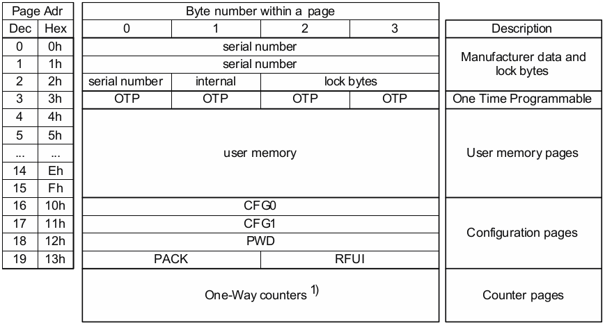

<!-- START doctoc generated TOC please keep comment here to allow auto update -->
<!-- DON'T EDIT THIS SECTION, INSTEAD RE-RUN doctoc TO UPDATE -->
**Table of Contents**  *generated with [DocToc](https://github.com/thlorenz/doctoc)*

- [NFC A NXP (MF0ULX1)](#nfc-a-nxp-mf0ulx1)

<!-- END doctoc generated TOC please keep comment here to allow auto update -->

# NFC A NXP (MF0ULX1)

- 26 B reserved for manufacturer and configuration data
- 2 B used for the read-only locking mechanism
- 4 B available as One Time Programmable (OTP) area
- 48 B user programmable read/write memory

- optional limit of unsuccessful attempts
- field programmable read-only locking function per page for the first 64 B

- serial number + internal: programmed e write protected
- lock byte 0 e 1: bit per il lock su OTP e user memory
	- Lx blocca la pagina x in read-only
	- BLx blocca ulteriori blocchi sull'area x
- OTP: default 0x0, a ogni WRITE i valori vengono OR'ed
- user data: anche accesso tramite password
- configuration:
	- AUTH0: pagina a partire dalla quale è richiesta la password verification  
		valori accettati [0x00, 0xff]  
		se impostato a un valore superiore all'ultima pagina di configurazione dell'utente, la password verification è disabilitata
	- ACCESS:
		- PROT:  
			0 protected write access  
			1 protected read/write access
		- CFGLCK:  
			0 writable user configuration  
			1 unwritable user configuration
		- AUTHLIM:  
			0 disabled negative password verification attempts  
			1-111 max negative password verification attempts
	- PWD: 4 B password
	- PACK: 2 B password acknowledge

<!--
Remark: Note that the password verification method available in then MF0ULx1 does not offer a high security protection. It is an easy and convenient way to prevent unauthorized memory access. If a higher level of protection is required, cryptographic methods on application layer can be used to increase overall system security.
-->

PWD e PACK scritti in LSB, stesso ordine usato col comando PWD_AUTH e la sua risposta.
A seguito di un comando valido READ o FAST_READ, non viene trasmeso nè PWD nè PACK, ma 0x00.
PWD e PACK sono writable anche se CFGLCK è settato a 1.
AUTH0 dovrebbe essere impostato alla pagina (18esima o 12h) in cui PWD è memorizzata dopo che PWD stessa è stata scritta.
Se AUTHLIM è impostato e il limite viene superato, ogni tentativo successivo indipendentemente dal fatto che la password successiva sia corretta o no il comando PWD_AUTH fallisce.
Tutti i counter possono essere incrementati e letti senza password verification.
Leggo il valore del contatore (3 B) usando il comando READ_CNT e li incremento usando INC_CNT.

|command|hex command code|
|-|-|
|GET_VERSION		|60	|
|READ			|30	|
|FAST_READ		|3A	|
|WRITE			|A2	|
|COMP_WRITE		|A0	|
|READ_CNT		|39	|
|INCR_CNT		|A5	|
|PWD_AUTH		|1B	|
|READ_SIG		|3C	|
|CHECK_TEARING_EVENT	|3E	|
|VCSL			|4B	|

|hex ACK/NAK code|ACK/NAK|
|-|-|
|A	|Acknowledge|
|0	|NAK for invalid argument|
|1	|NAK for parity or CRC error|
|4	|NAK for counter overflow|
|5, 7	|NAK for EEPROM write error|
|6, 9	|NAK, other error|

### GET_VERSION (60)

||||||
|-|-|-|-|-|
|1 B|2 B||8 B|2 B|
|GET_VERSION|CRC||Data|CRC|

### READ (30)

|||||||
|-|-|-|-|-|-|
|1 B|1 B|2 B||16 B|1 B|
|READ|Addr|CRC||Data|CRC|

Addr = 00 -> 13

rollover (riparte da 00) in caso di lettura oltre memoria massima o memoria protetta

READ sulle pagine contenenti PWD e PACK restituisce 00

### FAST_READ (3A)

||||||||
|-|-|-|-|-|-|-|
|1 B|1 B|1 B|2 B||n*4 B|2 B|
|FAST_READ|StartAddr|EndAddr|CRC||Data|CRC|

StartAddr = 00 -> 13
EndAddr = StartAddr -> 13

### WRITE (A2)

||||||
|-|-|-|-|-|
|1 B|1 B|4 B|2 B||4 b|
|WRITE|Addr|Data|CRC||ACK|

pagine 2 (lock bit) e 3 (OTP bit) protette

### COMP_WRITE (A0)

||||||
|-|-|-|-|-|
|1 B|1 B|2 B||4 b|
|COMP_WRITE|Addr|CRC||ACK|

|||||
|-|-|-|-|
|16 B|2 B||4 b|
|Data|CRC||ACK|

solo i 3 LSB di Data sono usati

### READ_CNT (39)

|||||||
|-|-|-|-|-|-|
|1 B|1 B|2 B||3 B|2 B|
|READ_CNT|Addr|CRC||DATA|CRC|

### INCR_CNT (A5)

|||||||
|-|-|-|-|-|-|
|1 B|1 B|4 B|2 B||4 b|
|INCR_CNT|Addr|IncrValue|CRC||ACK|

### PWD_AUTH (1B)

||||||
|-|-|-|-|-|
|1 B|4 B|2 B||2 B|2 B|
|PWD_AUTH|Pwd|CRC||PACK|CRC|

### READ_SIG (3C)

|||||||
|-|-|-|-|-|-|
|1 B|1 B|2 B||4 B|2 B|
|READ_SIG|Addr|CRC||Sign|CRC|

restituisce la firma ECC di 32 b per verificare il vendor NXP

### CHECK_TEARING_EVENT (3E)

|||||||
|-|-|-|-|-|-|
|1 B|1 B|2 B||1 B|4 b|
|CHECK_TEARING_EVENT|Addr|CRC||Valid|CRC|

identifica se un evento di tearing (possibile scrittura incompleta) è accaduto su uno specifico counter

Valid = BD  
Invalid = indirizzo del counter sul quale si è verificato il tearing

### VCSL (4B)

||||||||
|-|-|-|-|-|-|-|
|1 B|16 B|4 B|2 B||1 B|2 B|
|VCSL|IID|PCDCAPS|CRC||VCTID|CRC|

IID Installation IDentifier

VCTID Virtual Card Type IDentifier

